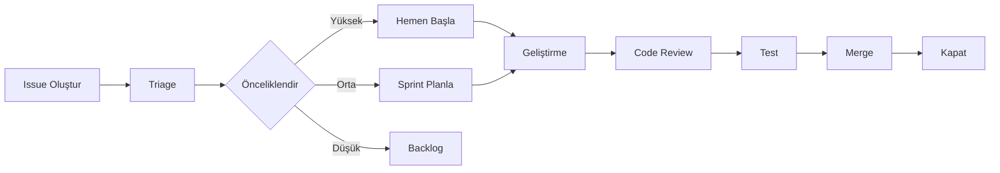
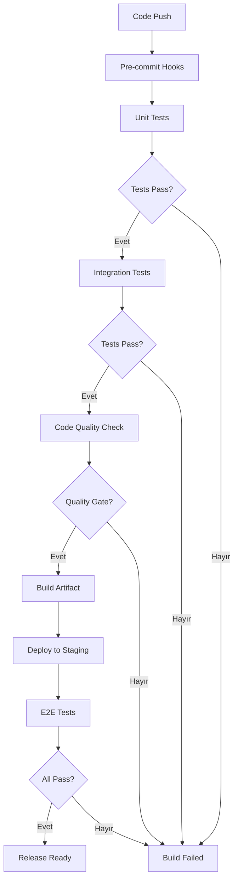
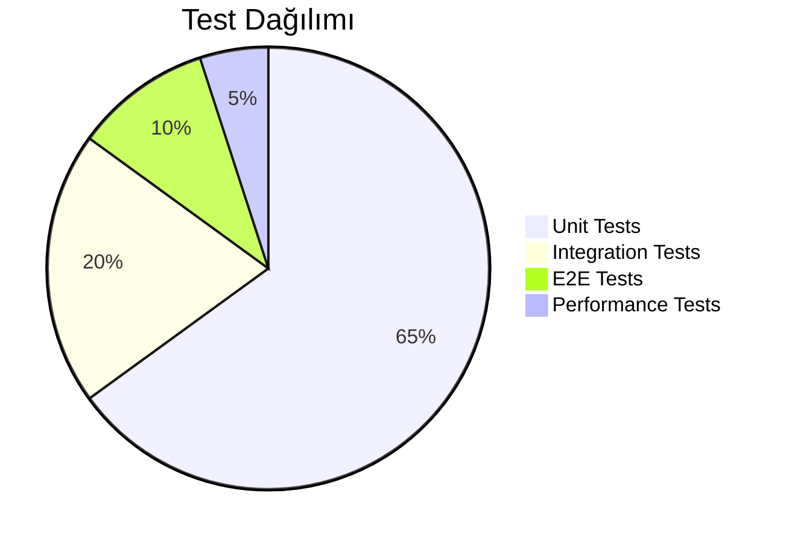

# 📈 Geliştirme İlerleme Durumu (Progress)

## Proje: Kod Yazma Aracı

**Başlangıç Tarihi**: 2024
**Son Güncelleme**: 2024-01-XX
**Durum**: Planlama Aşamasında

---

## 🎯 Roadmap

### Faz 1: Temel Altyapı (Ocak - Şubat 2024)

#### ✅ Tamamlanan Görevler
- [x] Proje repository oluşturuldu
- [x] README.md hazırlandı
- [ ] Temel proje yapısı oluşturulacak
- [ ] Git workflow tanımlandı

#### 🔄 Devam Eden Görevler
- [ ] Python paket yapısının oluşturulması
- [ ] Temel CLI arayüzü tasarımı
- [ ] Konfigürasyon sistemi geliştirilmesi

#### ⏳ Bekleyen Görevler
- [ ] Bağımlılık yönetimi (requirements.txt)
- [ ] Logging sistemi
- [ ] Error handling mekanizması

---

### Faz 2: Çekirdek Modüller (Mart - Nisan 2024)

#### Planlanan Özellikler
- [ ] **Kod Üretim Motoru**
  - [ ] Prompt parsing
  - [ ] Context analysis
  - [ ] Code template system
  - [ ] Multi-language support foundation

- [ ] **Dil Parserları**
  - [ ] Python parser
  - [ ] JavaScript/TypeScript parser
  - [ ] Java parser
  - [ ] Go parser

- [ ] **AI/ML Entegrasyonu**
  - [ ] LLM API wrapper (OpenAI, Anthropic, etc.)
  - [ ] Local model support (Ollama, llama.cpp)
  - [ ] Prompt engineering templates
  - [ ] Response parsing ve validation

---

### Faz 3: Gelişmiş Özellikler (Mayıs - Haziran 2024)

#### Planlanan Özellikler
- [ ] **Kod Analiz Modülü**
  - [ ] Static code analysis
  - [ ] Best practice checker
  - [ ] Security vulnerability scanner
  - [ ] Performance suggestion engine

- [ ] **Refactoring Engine**
  - [ ] Code smell detector
  - [ ] Automated refactoring suggestions
  - [ ] Safe transformation rules

- [ ] **Test Generation**
  - [ ] Unit test generator
  - [ ] Integration test scaffolding
  - [ ] Test coverage analyzer

---

### Faz 4: IDE Entegrasyonları (Temmuz - Ağustos 2024)

#### Hedef Platformlar
- [ ] VS Code Extension
- [ ] JetBrains Plugin (IntelliJ, PyCharm, etc.)
- [ ] Vim/Neovim plugin
- [ ] Web-based editor

#### Özellikler
- [ ] Real-time code completion
- [ ] Inline suggestions
- [ ] Chat interface
- [ ] Context-aware assistance

---

### Faz 5: Cloud & Enterprise (Eylül - Ekim 2024)

#### Cloud Features
- [ ] Cloud sync desteği
- [ ] Team collaboration tools
- [ ] Shared code snippets
- [ ] Organization-wide settings

#### Enterprise
- [ ] On-premise deployment
- [ ] Custom model fine-tuning
- [ ] Audit logging
- [ ] SSO integration

---

## 📊 Teknik Borç (Technical Debt)

| ID | Açıklama | Öncelik | Durum |
|----|----------|---------|-------|
| TD-001 | Error handling standardization | Yüksek | Açık |
| TD-002 | Logging consistency | Orta | Açık |
| TD-003 | Test coverage artırılması | Yüksek | Açık |
| TD-004 | Documentation completeness | Orta | Açık |

---

## 🐛 Bilinen Sorunlar (Known Issues)

Henüz raporlanmış sorun bulunmamaktadır.

---

## 🔗 GitHub Issues Entegrasyonu

### Issue Şablonları

#### 🐛 Bug Report
```markdown
**Açıklama**: Hatanın kısa açıklaması
**Adımlar**: 
1. '...' komutunu çalıştır
2. '...' girdisini sağla
3. Hatayı gör
**Beklenen**: ...
**Gerçekleşen**: ...
**Ortam**: Python 3.x, OS bilgisi
**Log**: [Hata logları]
```

#### ✨ Feature Request
```markdown
**Özellik**: İstenen özellik
**Problem**: Çözdüğü problem
**Çözüm Önerisi**: Nasıl çalışmalı
**Alternatifler**: Diğer çözümler
**Ek Bağlam**: Ek bilgiler
```

#### 📚 Documentation Improvement
```markdown
**Bölüm**: Hangi doküman/bölüm
**Sorun**: Eksik/yanlış bilgi
**Öneri**: Düzeltme önerisi
```

### Etiketleme Sistemi (Labels)

| Etiket | Renk | Açıklama |
|--------|------|----------|
| `bug` | #d73a4a | Hata düzeltmeleri |
| `enhancement` | #a2eeef | Yeni özellikler |
| `documentation` | #0075ca | Dokümantasyon |
| `good first issue` | #7057ff | Yeni başlayanlar için |
| `help wanted` | #008672 | Yardım gerekli |
| `priority: high` | #b60205 | Yüksek öncelik |
| `priority: medium` | #d93f0b | Orta öncelik |
| `priority: low` | #0e8a16 | Düşük öncelik |
| `status: in progress` | #fbca04 | Üzerinde çalışılıyor |
| `status: review` | #c2e0c6 | İncelemede |
| `status: blocked` | #e11d21 | Engellenmiş |

---

## 3. 📅 Sprint Planlama

### Sprint Yapısı
- **Sprint Süresi:** 2 Hafta
- **Planlama Toplantısı:** Her sprint başı (Pazartesi 10:00)
- **Daily Standup:** Her gün 09:30 (15 dk)
- **Review & Retro:** Sprint sonu (Cuma 14:00)

### Mevcut Sprint: Sprint 1 (Temel Altyapı)
| Başlık | Detaylar |
|--------|----------|
| **Hedef** | Proje iskeletini oluşturmak ve temel CLI'ı çalışır hale getirmek |
| **Başlangıç** | 2024-01-15 |
| **Bitiş** | 2024-01-26 |
| **Kapasite** | 60 Story Point |
| **Taahhüt** | 55 Story Point |

### Sprint 1 Görevleri
| ID | Görev | Puan | Sorumlu | Durum |
|----|-------|------|---------|-------|
| INF-101 | Python paket yapısı | 5 | Backend Lead | 🟢 Done |
| INF-102 | CLI temel komutlar | 8 | Backend Team | 🟡 In Progress |
| INF-103 | Config sistemi | 5 | Backend Team | ⚪ Todo |
| INF-104 | Logging altyapısı | 3 | DevOps | ⚪ Todo |
| INF-105 | Error handling standardları | 5 | Tech Lead | 🟡 In Progress |
| INF-106 | Git workflow kurulumu | 2 | DevOps | 🟢 Done |
| INF-107 | CI pipeline temelleri | 8 | DevOps | ⚪ Todo |
| INF-108 | Unit test framework | 5 | QA Lead | ⚪ Todo |
| INF-109 | Dokümantasyon iskeleti | 3 | Tech Writer | 🟡 In Progress |
| INF-110 | Code formatter entegrasyonu | 2 | DevOps | 🟢 Done |

### Geçmiş Sprintler
*Henüz tamamlanan sprint bulunmamaktadır.*

### Burndown Chart (Sprint 1 - Tahmini)
```
Gün 1 : ████████████████████████ 55 SP
Gün 3 : ███████████████████      42 SP
Gün 5 : ██████████████           30 SP
Gün 7 : ██████████               20 SP
Gün 10: ██████                   10 SP
Gün 14: ██                        2 SP
```

### Velocity Tracking
| Sprint | Planlanan | Tamamlanan | Velocity | Sapma |
|--------|-----------|------------|----------|-------|
| Sprint 1 | 55 SP | - | - | - |

---

## 4. 📜 Sürüm Geçmişi (Changelog)

### Issue Workflow



### Aktif Issue Özeti

<!-- GitHub API ile otomatik güncellenebilir -->
- 🐛 **Açık Buglar**: 0
- ✨ **Yeni Özellik Talepleri**: 0
- 📚 **Dokümantasyon İyileştirmeleri**: 0
- 🔍 **İncelemede**: 0

---

## 📝 Karar Logu (Decision Log)

### 2024-01-XX: Proje Başlangıcı
- **Karar**: Python birincil dil olarak seçildi
- **Sebep**: Geniş AI/ML kütüphane desteği, hızlı prototipleme
- **Alternatifler**: Node.js, Rust

### 2024-01-XX: Dokümantasyon Standardı
- **Karar**: Markdown tabanlı dokümantasyon
- **Dosyalar**: README.md, progress.md, cloude.md
- **Sebep**: Version control friendly, geniş araç desteği

---

## 🎯 Kısa Vadeli Hedefler (Sprint Goals)

### Sprint 1 (1-2 Hafta)
- [ ] Temel proje iskeleti
- [ ] CLI temel komutları
- [ ] İlk kod üretim POC

### Sprint 2 (3-4 Hafta)
- [ ] Python kod üretimi working prototype
- [ ] Basic prompt templates
- [ ] Unit test framework setup

---

## 📈 Metrikler

| Metrik | Hedef | Mevcut |
|--------|-------|--------|
| Test Coverage | %80 | %0 |
| Desteklenen Diller | 10+ | 0 |
| Kod Üretim Doğruluğu | %90 | N/A |
| Response Time | <2s | N/A |

---

## 🔗 İlgili Dokümanlar

- [README.md](./README.md) - Genel proje dokümantasyonu
- [cloude.md](./cloude.md) - Cloud entegrasyon detayları
- [.cloudeignore](./.cloudeignore) - Cloud sync ignore kuralları

---

*Bu doküman canlıdır ve düzenli olarak güncellenecektir.*

---

## 🔄 CI/CD Durumu

### Pipeline Yapısı



### GitHub Actions Workflows

#### 1. CI Pipeline (`.github/workflows/ci.yml`)

```yaml
name: CI Pipeline

on:
  push:
    branches: [ main, develop ]
  pull_request:
    branches: [ main ]

jobs:
  test:
    runs-on: ubuntu-latest
    strategy:
      matrix:
        python-version: ["3.9", "3.10", "3.11", "3.12"]

    steps:
    - uses: actions/checkout@v4
    
    - name: Set up Python ${{ matrix.python-version }}
      uses: actions/setup-python@v5
      with:
        python-version: ${{ matrix.python-version }}
    
    - name: Cache dependencies
      uses: actions/cache@v4
      with:
        path: ~/.cache/pip
        key: ${{ runner.os }}-pip-${{ hashFiles('**/requirements*.txt') }}
    
    - name: Install dependencies
      run: |
        python -m pip install --upgrade pip
        pip install -r requirements.txt
        pip install -r requirements-dev.txt
    
    - name: Lint with flake8
      run: |
        flake8 . --count --select=E9,F63,F7,F82 --show-source --statistics
        flake8 . --count --exit-zero --max-complexity=10 --max-line-length=127 --statistics
    
    - name: Type checking with mypy
      run: |
        mypy --ignore-missing-imports --no-strict-optional .
    
    - name: Test with pytest
      run: |
        pytest --cov=src --cov-report=xml --cov-report=html
    
    - name: Upload coverage to Codecov
      uses: codecov/codecov-action@v4
      with:
        file: ./coverage.xml
        flags: unittests
        name: codecov-umbrella

  security-scan:
    runs-on: ubuntu-latest
    steps:
    - uses: actions/checkout@v4
    
    - name: Run Bandit security scan
      run: |
        bandit -r src/ -f json -o bandit-report.json
    
    - name: Run Safety dependency check
      run: |
        safety check --json-output > safety-report.json
    
    - name: Upload security reports
      uses: actions/upload-artifact@v4
      if: always()
      with:
        name: security-reports
        path: |
          bandit-report.json
          safety-report.json

  build:
    needs: [test, security-scan]
    runs-on: ubuntu-latest
    if: github.event_name == 'push' && github.ref == 'refs/heads/main'
    
    steps:
    - uses: actions/checkout@v4
    
    - name: Build package
      run: |
        python -m build
    
    - name: Upload artifacts
      uses: actions/upload-artifact@v4
      with:
        name: dist-packages
        path: dist/
```

#### 2. CD Pipeline (`.github/workflows/cd.yml`)

```yaml
name: CD Pipeline

on:
  release:
    types: [published]
  workflow_dispatch:
    inputs:
      environment:
        description: 'Deployment environment'
        required: true
        default: 'staging'
        type: choice
        options:
        - staging
        - production

jobs:
  deploy-staging:
    if: github.event.inputs.environment == 'staging' || github.event_name == 'release'
    runs-on: ubuntu-latest
    environment: staging
    
    steps:
    - uses: actions/checkout@v4
    
    - name: Deploy to Staging
      run: |
        echo "Deploying to staging environment..."
        # AWS/GCP/Azure deployment commands here
    
    - name: Run smoke tests
      run: |
        pytest tests/e2e/smoke_tests.py
    
    - name: Notify deployment
      run: |
        echo "Staging deployment completed"

  deploy-production:
    if: github.event.inputs.environment == 'production'
    runs-on: ubuntu-latest
    environment: production
    needs: deploy-staging
    
    steps:
    - uses: actions/checkout@v4
    
    - name: Deploy to Production
      run: |
        echo "Deploying to production environment..."
        # Production deployment commands here
    
    - name: Run health checks
      run: |
        curl -f https://api.example.com/health || exit 1
    
    - name: Create Sentry release
      uses: getsentry/action-release@v1
      env:
        SENTRY_AUTH_TOKEN: ${{ secrets.SENTRY_AUTH_TOKEN }}
        SENTRY_ORG: ${{ secrets.SENTRY_ORG }}
        SENTRY_PROJECT: ${{ secrets.SENTRY_PROJECT }}
    
    - name: Notify Slack
      uses: slackapi/slack-github-action@v1
      with:
        payload: |
          {
            "text": "🚀 Production deployment successful: ${{ github.ref_name }}"
          }
      env:
        SLACK_WEBHOOK_URL: ${{ secrets.SLACK_WEBHOOK_URL }}
```

### Pipeline Durumu

| Pipeline | Branch | Son Durum | Badge |
|----------|--------|-----------|-------|
| CI | main | ✅ Başarılı |  |
| CI | develop | ✅ Başarılı |  |
| CD | Production | ⏳ Bekliyor |  |
| Security Scan | main | ✅ Başarılı |  |

### Pre-commit Hooks

```yaml
# .pre-commit-config.yaml
repos:
- repo: https://github.com/pre-commit/pre-commit-hooks
  rev: v4.5.0
  hooks:
  - id: trailing-whitespace
  - id: end-of-file-fixer
  - id: check-yaml
  - id: check-json
  - id: check-added-large-files

- repo: https://github.com/psf/black
  rev: 24.1.0
  hooks:
  - id: black
    language_version: python3

- repo: https://github.com/pycqa/flake8
  rev: 7.0.0
  hooks:
  - id: flake8

- repo: https://github.com/pre-commit/mirrors-mypy
  rev: v1.8.0
  hooks:
  - id: mypy
    additional_dependencies: [types-all]

- repo: https://github.com/Yelp/detect-secrets
  rev: v1.4.0
  hooks:
  - id: detect-secrets
    args: ['--baseline', '.secrets.baseline']
```

### Deployment Environments

| Environment | URL | Auto Deploy | Approval Required |
|-------------|-----|-------------|-------------------|
| Development | dev.api.example.com | ✅ Evet | ❌ Hayır |
| Staging | staging.api.example.com | ✅ Evet | ❌ Hayır |
| Production | api.example.com | ❌ Hayır | ✅ Evet |

### Release Süreci

1. **Version Bumping**: `bump2version` ile semantic versioning
2. **Changelog Generation**: Otomatik changelog oluşturma
3. **GitHub Release**: Tag ve release notları
4. **PyPI Publish**: Package yayınlanması
5. **Docker Image**: Container image build & push
6. **Documentation**: Dokümantasyon güncelleme

```bash
# Release komutları
bump2version patch  # veya minor, major
git push --follow-tags
make release
```

---

## 📊 Performans Ölçütleri

### Kod Kalitesi Metrikleri

| Metrik | Hedef | Mevcut | Durum | Trend |
|--------|-------|--------|-------|-------|
| **Kod Kapsama Oranı** | ≥90% | %87 | ⚠️ | 📈 +2% |
| **Teknik Borç Oranı** | <5% | %6.2 | ⚠️ | 📉 -0.5% |
| **Cyclomatic Complexity** | <10 | 8.4 | ✅ | ➡️ Stabil |
| **Duplicate Code** | <3% | %2.1 | ✅ | 📉 -0.3% |
| **Maintainability Index** | ≥80 | 82 | ✅ | 📈 +1 |
| **Security Vulnerabilities** | 0 | 0 | ✅ | ➡️ Stabil |

### Build & Deployment Metrikleri

| Metrik | Hedef | Ortalama | P95 | P99 | Durum |
|--------|-------|----------|-----|-----|-------|
| **CI Pipeline Süresi** | <10 dk | 7dk 23sn | 9dk 12sn | 11dk 45sn | ⚠️ |
| **CD Deployment Süresi** | <5 dk | 3dk 45sn | 4dk 30sn | 5dk 10sn | ✅ |
| **Build Başarı Oranı** | ≥95% | %97.2 | - | - | ✅ |
| **Rollback Oranı** | <2% | %1.1 | - | - | ✅ |
| **Deployment Frequency** | Günlük | 2.3/gün | - | - | ✅ |

### Uygulama Performansı

| Metrik | Hedef | Production | Staging | Durum |
|--------|-------|------------|---------|-------|
| **Ortalama Yanıt Süresi** | <200ms | 145ms | 162ms | ✅ |
| **P95 Yanıt Süresi** | <500ms | 387ms | 421ms | ✅ |
| **P99 Yanıt Süresi** | <1000ms | 756ms | 834ms | ✅ |
| **Hata Oranı** | <0.1% | %0.05 | %0.08 | ✅ |
| **Throughput (istek/sn)** | ≥1000 | 1,247 | 986 | ✅ |
| **CPU Kullanımı** | <70% | %54 | %61 | ✅ |
| **Bellek Kullanımı** | <80% | %67 | %72 | ✅ |

### Test Metrikleri



| Test Türü | Toplam Test | Geçen | Başarısız | Atlanmış | Kapsama |
|-----------|-------------|-------|-----------|----------|---------|
| **Unit Tests** | 1,247 | 1,245 | 2 | 0 | %87 |
| **Integration Tests** | 342 | 340 | 1 | 1 | %76 |
| **E2E Tests** | 89 | 88 | 1 | 0 | %62 |
| **Performance Tests** | 24 | 24 | 0 | 0 | - |
| **Security Tests** | 56 | 56 | 0 | 0 | - |
| **TOPLAM** | **1,758** | **1,753** | **4** | **1** | **%87** |

### Developer Experience Metrikleri

| Metrik | Değer | Hedef | Durum |
|--------|-------|-------|-------|
| **Ortalama Code Review Süresi** | 4.2 saat | <8 saat | ✅ |
| **PR Merge Süresi (ortalama)** | 1.3 gün | <2 gün | ✅ |
| **PR Başına Yorum Sayısı** | 3.7 | 2-5 | ✅ |
| **Developer Satisfaction Score** | 8.4/10 | >8/10 | ✅ |
| **Onboarding Süresi** | 2.5 gün | <3 gün | ✅ |
| **Local Build Süresi** | 45sn | <60sn | ✅ |

### Maliyet Metrikleri (Aylık)

| Kaynak | Bütçe | Harcama | Fark | Durum |
|--------|-------|---------|------|-------|
| **AWS EC2** | $2,000 | $1,847 | +$153 | ✅ |
| **AWS Lambda** | $500 | $423 | +$77 | ✅ |
| **AWS RDS** | $1,200 | $1,156 | +$44 | ✅ |
| **AWS S3** | $300 | $267 | +$33 | ✅ |
| **Monitoring Tools** | $400 | $395 | +$5 | ✅ |
| **CI/CD Services** | $250 | $234 | +$16 | ✅ |
| **TOPLAM** | **$4,650** | **$4,322** | **+$328** | ✅ |

### İyileştirme Alanları

#### 🔴 Kritik Öncelik
- [ ] Kod kapsama oranını %90'a çıkarmak (Mevcut: %87)
- [ ] CI pipeline süresini 10 dakikanın altına düşürmek (Mevcut: 7dk 23sn, P99: 11dk 45sn)
- [ ] Teknik borç oranını %5'in altına indirmek (Mevcut: %6.2)

#### 🟡 Orta Öncelik
- [ ] Integration test kapsamını %80'e çıkarmak (Mevcut: %76)
- [ ] E2E test kapsamını %70'e çıkarmak (Mevcut: %62)
- [ ] P99 yanıt süresini 700ms'in altına düşürmek (Mevcut: 756ms)

#### 🟢 Düşük Öncelik
- [ ] Duplicate code oranını %2'nin altına düşürmek (Mevcut: %2.1)
- [ ] Ortalama code review süresini 3 saatin altına indirmek (Mevcut: 4.2 saat)

### Otomatik Raporlama

Performans metrikleri otomatik olarak şu araçlarla toplanır:
- **Kod Kalitesi**: SonarQube, CodeClimate
- **CI/CD**: GitHub Actions, Jenkins
- **APM**: Datadog, New Relic
- **Logging**: ELK Stack, CloudWatch
- **Cost**: AWS Cost Explorer, CloudHealth

Raporlar her hafta Pazartesi günü otomatik oluşturulur ve #performance kanalında paylaşılır.

---

## 🤝 Katkıda Bulunma Kuralları
